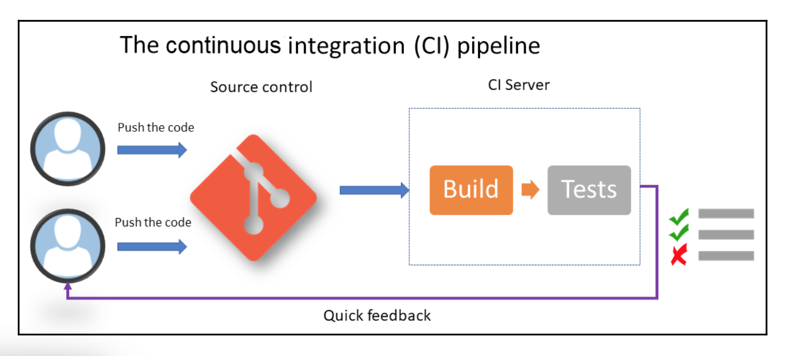

### CI/CD
#### Continous Integration
- CI is an automatic process that allows you to check the completeness of an application's code every time a team member makes a change. 
- CI requires the implementation of processes such (branch,commit, pull request, code review)
- To implement CI, it is necessary to have a Source Code Manager(SCM) 

- The diagram shows the cyclical steps of continous integration that include the code being pushed to the SCM by the team members and the execution of the build and test by the CI server.

